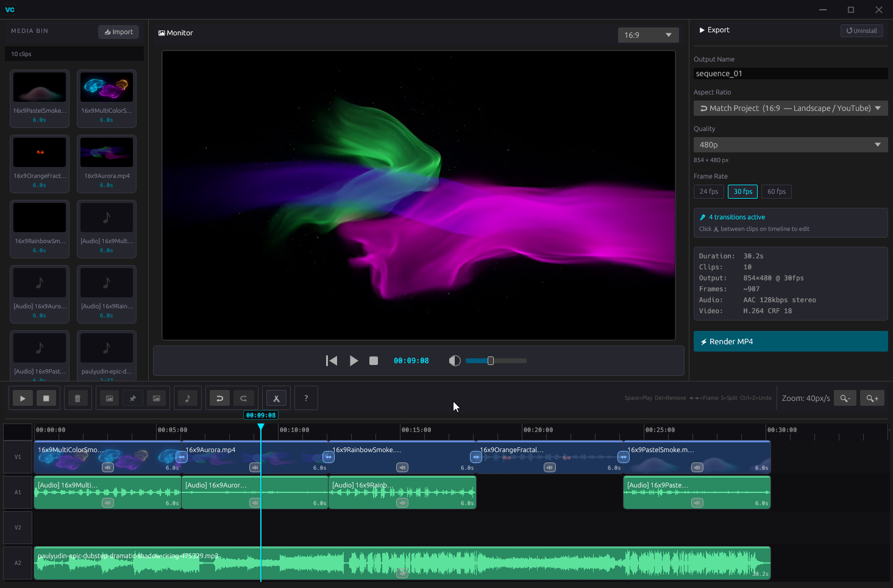

<div align="center">

# ⚡ VeloCut

**A fast, native desktop video editor written in Rust.**


</div>

---

## What is VeloCut?

VeloCut is a native desktop video editor built entirely in Rust. It targets the gap between heavyweight professional editors and simple clip trimmers — fast to launch, lightweight on resources, and designed for direct, keyboard-friendly editing workflows.

The UI is built with [egui](https://github.com/emilk/egui) / [eframe](https://github.com/emilk/egui/tree/master/crates/eframe). All media decoding and encoding is handled by a custom-forked [ffmpeg-the-third](https://github.com/eric-lautanen/velocut-ffmpeg-the-third) binding against a statically compiled FFmpeg.

---
<div style="text-align: center;">
  
</div>
## Features

- **Multi-track timeline** — Four lanes (V1/A1/V2/A2) with drag-and-drop from the media library
- **Real-time scrubbing** — Four-tier scrub system: instant nearest-cached frame (L1), per-pixel exact decode (L2), 2s coarse prefetch (L2b), and 150ms idle precise frame (L3)
- **Smooth playback** — Dedicated 32-frame buffered playback pipeline, PTS-gated and clocked by `stable_dt` for accurate audio/video sync
- **Waveform display** — 4000-column waveform overlays on audio/video clips, rendered at clip pixel width with per-clip gain visualization
- **Per-clip volume** — dB-space volume slider per clip (−60 to +6 dB) with visual waveform gain feedback
- **Transitions** — Cut and Crossfade transitions between clips with configurable duration, rendered via stride-aware YUV420P frame blending
- **Multi-clip import** — Batch import from file dialog or drag-and-drop onto the window
- **Library management** — Thumbnail grid with multi-select (Ctrl, Shift, Ctrl+A), drag-to-timeline, right-click context menu
- **Export** — H.264/MP4 encode at 480p/720p/1080p/1440p/2160p, 24/30/60 fps, with live progress bar and per-job cancellation
- **Frame save** — Export any single frame to PNG from the preview panel
- **Undo/Redo** — 50-level snapshot-based undo with runtime field preservation (playback, encode state unaffected by undo)
- **Session persistence** — Project state saved and restored between launches via eframe storage
- **Project reset** — Two-stage ⊘ Reset button with 5-second confirmation window and ordered 8-step teardown
- **Custom chrome** — Frameless window with custom title bar, software resize handles, and accent-colored branding

---

## Platform

| Platform | Status |
|----------|--------|
| Windows (MINGW64) | ✅ Supported |
| Linux | 🔬 Untested |
| macOS | 🔬 Untested |

---

## Workspace Structure

```
velocut/
  Cargo.toml               ← workspace root; shared [workspace.dependencies]
  assets/                  ← fonts, icons
  crates/
    velocut-core/          ← pure data & contracts (no UI, no FFmpeg)
    velocut-media/         ← FFmpeg worker threads (no egui)
    velocut-ui/            ← egui app + binary entry point
```

**Dependency rules:** `velocut-ui` → `core` + `media` · `velocut-media` → `core` · `core` and `media` → no egui

---

### velocut-core

Pure data types and contracts shared across the workspace. No UI, no FFmpeg.

| File | Purpose |
|------|---------|
| `state.rs` | Serializable `ProjectState`: library clips, timeline clips, playback state, encode status, transitions. Runtime-only fields marked `#[serde(skip)]`. |
| `commands.rs` | `EditorCommand` enum — every user action emitted by UI modules and dispatched by `app.rs::process_command()`. |
| `media_types.rs` | `MediaResult` variants sent from worker threads to the UI channel: `AudioPath`, `Duration`, `Thumbnail`, `Waveform`, `VideoSize`, `FrameSaved`, `VideoFrame`, `EncodeProgress`, `EncodeDone`, `EncodeError`. Also `PlaybackFrame` (RGBA + PTS) for the dedicated playback channel. |
| `transitions.rs` | `TransitionType` (Cut, Crossfade) and `TimelineTransition` storage. |
| `helpers/time.rs` | `format_time(s)` → `MM:SS:FF` (30 fps) used on the timeline ruler and preview transport. `format_duration(s)` → `H:MM:SS / M:SS / S.Xs` used in the library grid. |
| `helpers/geometry.rs` | `aspect_ratio_value(ar)` and `aspect_ratio_label(ar)` — shared between `export_module.rs` and `video_module.rs`. |

---

### velocut-media

All FFmpeg work runs here on background threads. No egui dependency.

| File | Purpose |
|------|---------|
| `worker.rs` | `MediaWorker` — public API for `velocut-ui`. Owns: probe semaphore (max 4 concurrent), dedicated playback decode thread (32-frame bounded channel), dedicated scrub result channel (capacity 8, decoupled from probe/encode traffic), per-job `Arc<AtomicBool>` cancellation map. |
| `encode.rs` | Multi-clip H.264/MP4 pipeline. CRF 18 + preset fast. Monotonic PTS reassignment across clip boundaries. Crossfade blending via `helpers/yuv.rs`. Audio gated per-clip via `skip_audio`. Sends `EncodeProgress` every 15 frames. |
| `decode.rs` | `LiveDecoder` — stateful decoder with pooled output buffer, `SwsContext` reuse across scrub frames when source format/dimensions match, and decode-only pre-roll (`advance_to`) that scales exactly once on the target frame. `decode_frame()` — one-shot HQ extraction. |
| `probe.rs` | Duration, video dimensions, thumbnail (scaled to 320px at 10% seek). Runs under the probe semaphore. |
| `waveform.rs` | In-process audio decode via `ffmpeg-the-third`. Handles all common sample formats (f32, i16, i32, f64, u8 packed/planar). Downsamples to 4000-column peak array. |
| `audio.rs` | In-process audio decode + resample to 44100 Hz stereo f32le → temp WAV for rodio. No CLI subprocess or PATH dependency. |
| `helpers/seek.rs` | `seek_to_secs` with Windows EPERM soft-fail guard. Required at every seek site — bypassing it causes wrong-position frames on Windows with certain containers at offset 0. |
| `helpers/yuv.rs` | Stride-aware YUV420P `extract_yuv`, `write_yuv`, and `blend_yuv_frame` for crossfade transitions. All encode and crossfade paths must go through these — direct plane indexing produces corrupted output when FFmpeg adds row padding. |

---

### velocut-ui

The egui application and binary entry point.

| File | Purpose |
|------|---------|
| `main.rs` | FFmpeg init, frameless window config, font setup, eframe run. |
| `app.rs` | `VeloCutApp`: concrete typed module fields, full command dispatch in `process_command()`, undo/redo stacks (50 entries), encode orchestration, media polling. `restore_snapshot()` re-queues probes for any library clip with empty `waveform_peaks` after undo. |
| `context.rs` | `AppContext`: runtime-only handles (worker, caches, audio sinks). `ingest_media_results()` drains the scrub channel first (high-priority), then the shared result channel. Frame bucket cache capped at 192 MB; evicts the 32 furthest entries from playhead using O(N) partial select. |
| `theme.rs` | Color constants and egui style configuration. |
| `helpers/clip_query.rs` | Canonical lookup helpers (`clip_at_time`, `library_entry_for`, `is_extracted_audio_clip`, `linked_audio_clip`, etc.) replacing repeated inline `iter().find(...)` chains across the codebase. |
| `helpers/format.rs` | UI-layer string utilities: `truncate(s, max)` for fixed-width tile labels. |
| `modules/library.rs` | Thumbnail card grid with multi-select, drag-to-timeline, right-click context menu, batch import. Manual row chunking (`chunks(cols)` + `ui.horizontal()`) — required for correct wrapping inside `ScrollArea`. |
| `modules/preview_module.rs` | Live frame display with thumbnail fallback. Transport bar and volume slider via raw coordinate math. |
| `modules/timeline.rs` | Scrollable ruler + 4-lane track view. Clip blocks with thumbnail strips and waveform overlays. Floating `egui::Area` popups for transitions and per-clip volume. Scrub deduplication (sub-frame deltas dropped). Hotkeys: Space, Delete, ←/→. |
| `modules/export_module.rs` | Resolution/fps/aspect controls, live encode progress, two-stage ⊘ Reset, auto-dismissing done/error banners. |
| `modules/audio_module.rs` | Rodio sink manager. Evicts stale sinks when timeline clips are removed (handles undo/redo during active playback). |
| `modules/video_module.rs` | Playback pipeline (PTS-gated single-slot) and 4-tier scrub system. `request_repaint()` after frame promotion is intentional — frames arrive from a background thread. |

---

## Key Dependencies

| Crate | Version | Purpose |
|-------|---------|---------|
| `eframe` / `egui` | 0.33 | UI framework |
| `ffmpeg-the-third` | forked | FFmpeg bindings (static) |
| `crossbeam-channel` | 0.5 | Worker thread channels |
| `rodio` | 0.21.1 | Audio playback |
| `rfd` | 0.14 | Native file dialogs |
| `serde` | 1.0 | Project serialization |
| `uuid` | 1.10 | Clip identity |
| `egui-desktop` | 0.2.2 | Custom title bar + resize handles |
| `png` | 0.18.1 | Icon loading, frame export |

### FFmpeg Fork

VeloCut uses a custom fork of `ffmpeg-the-third` at [`eric-lautanen/velocut-ffmpeg-the-third`](https://github.com/eric-lautanen/velocut-ffmpeg-the-third) (branch `master`). The fork exposes low-level encoder/decoder flush control that upstream does not provide. This is a long-term owned dependency, not a temporary patch — do not replace it with upstream.

---

## Building

### Prerequisites

- Rust 1.93+
- MSYS2 / MINGW64 (Windows)
- The forked FFmpeg static libraries (linked via the `ffmpeg-the-third` fork — see its README for build instructions)

### Build

```bash
cargo build --release
```

The release binary is at `target/release/velocut.exe`.

---

## Architecture Notes

**Command flow:** UI modules receive `&ProjectState` (read-only) and emit `EditorCommand` values into a `pending_cmds` vec. After each frame, `app.rs::process_command()` dispatches all commands and mutates state. Modules never mutate state directly.

**Frame pipeline (per tick, in order):**
1. `poll_media()` → `poll_playback()` — frame cache writes
2. `update()` — preview reads frame cache, panels render
3. `tick()` — additional cache evictions

Evictions that must take effect before the next render belong in `poll_playback()`, not `tick()`.

**Scrub tiers:**
| Tier | Trigger | Latency |
|------|---------|---------|
| L1 | Nearest cached bucket frame | 0 ms |
| L2 | Exact-timestamp decode, every drag pixel | ~decode time |
| L2b | Coarse 2s prefetch window | Background |
| L3 | Precise frame after 150ms idle debounce | ~decode time |

**Playback clock:** `stable_dt` is the master clock — `current_time += stable_dt` every frame. PTS from decoded frames is used only for frame promotion gating, never for advancing time.

**Undo snapshots:** Full `ProjectState` clones, capped at 50 entries. Runtime-only fields (playback position, encode progress, pending queues) are preserved from live state after each undo/redo. Clips with empty `waveform_peaks` after a restore are automatically re-queued for probing.

**Adding a feature:**
1. Add `EditorCommand` variant in `velocut-core/src/commands.rs`
2. Create `modules/mymodule.rs` implementing `EditorModule`
3. Add `pub mod mymodule;` in `modules/mod.rs`
4. Add a concrete typed field in `VeloCutApp` (app.rs) and initialize in `new()`
5. Call `self.mymodule.ui(...)` in the appropriate panel in `update()`
6. Add a match arm in `process_command()`
7. If new `MediaResult` variants are needed: add to `media_types.rs`, handle in `context.rs::ingest_media_results()` only

---

## Acknowledgments

VeloCut was 99.9% coded by [Claude](https://claude.ai) (Sonnet 4.5 / 4.6) — Anthropic's AI assistant — in collaboration with Eric Lautanen. A genuine human-AI co-authorship from architecture through implementation.  Emoji font hacks & font-family juggling by Grok (thanks, Ara). Because tofu blocks are unforgivable.

---

## License

MIT License

Copyright (c) 2026 Eric Lautanen

Permission is hereby granted, free of charge, to any person obtaining a copy of this software and associated documentation files (the "Software"), to deal in the Software without restriction, including without limitation the rights to use, copy, modify, merge, publish, distribute, sublicense, and/or sell copies of the Software, and to permit persons to whom the Software is furnished to do so, subject to the following conditions:

The above copyright notice and this permission notice shall be included in all copies or substantial portions of the Software.

THE SOFTWARE IS PROVIDED "AS IS", WITHOUT WARRANTY OF ANY KIND, EXPRESS OR IMPLIED, INCLUDING BUT NOT LIMITED TO THE WARRANTIES OF MERCHANTABILITY, FITNESS FOR A PARTICULAR PURPOSE AND NONINFRINGEMENT. IN NO EVENT SHALL THE AUTHORS OR COPYRIGHT HOLDERS BE LIABLE FOR ANY CLAIM, DAMAGES OR OTHER LIABILITY, WHETHER IN AN ACTION OF CONTRACT, TORT OR OTHERWISE, ARISING FROM, OUT OF OR IN CONNECTION WITH THE SOFTWARE OR THE USE OR OTHER DEALINGS IN THE SOFTWARE.