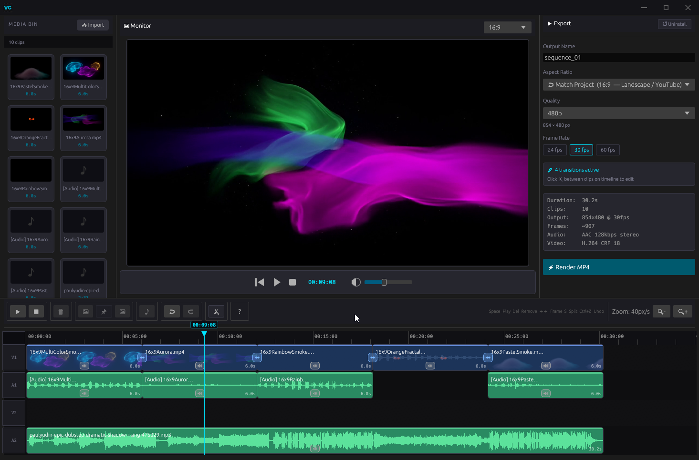

<div align="center">

#  VeloCut

**A fast, native desktop video editor written in Rust.**




[Download v0.1.5 (Windows)](https://github.com/Eric-Lautanen/velocut/releases/latest)

</div>

---

## What is VeloCut?

VeloCut is a native desktop video editor built entirely in Rust. It targets the gap between heavyweight professional editors and simple clip trimmers — fast to launch, lightweight on resources, and designed for direct, keyboard-friendly editing workflows.

The UI is built with [egui](https://github.com/emilk/egui) / [eframe](https://github.com/emilk/egui/tree/master/crates/eframe). All media decoding and encoding is handled by a custom-forked [ffmpeg-the-third](https://github.com/eric-lautanen/velocut-ffmpeg-the-third) binding against a statically compiled FFmpeg with D3D11VA hardware acceleration.

---

## Features

- **Multi-track timeline** — Four lanes (V1/A1/V2/A2) with drag-and-drop from the media library
- **Real-time scrubbing** — Four-tier scrub system: instant nearest-cached frame (L1), per-pixel 320px exact decode (L2), 2s coarse prefetch (L2b), and 150ms idle HQ native-resolution precise frame (L3)
- **Smooth playback** — Dedicated 32-frame buffered playback pipeline, PTS-gated and clocked by `stable_dt` for accurate audio/video sync
- **Hardware acceleration** — D3D11VA GPU-accelerated decode for H.264, HEVC, VP9, AV1, and MPEG-2 (including P010LE 10-bit); automatic CPU fallback. HW encode in priority order: AMF (D3D11) → NVENC (CUDA) → VAAPI → VideoToolbox → libx264. `probe_hw_encode_capabilities()` probes at startup so the export UI can annotate resolution options. SW encode capped at half logical CPUs, `preset=medium` to stay responsive at 2K/4K
- **Waveform display** — 4000-column waveform overlays on audio/video clips, rendered at clip pixel width with per-clip gain visualization
- **Per-clip volume** — dB-space volume slider per clip (−60 to +6 dB) with visual waveform gain feedback
- **Transitions** — Cut, Crossfade (dissolve), Dip to Black, Dip to White, Iris (circular aperture), Wipe (left-to-right feathered bar), Push (hard-displacement slide), Barn Doors, and Clock Wipe between clips with configurable duration. Blend rendered via rayon-parallelised RGBA `apply_rgba` (playback/scrub) and stride-aware YUV420P `apply` (encode). New transitions register in one line via the `declare_transitions!` macro
- **Transition playback** — Live blend playback across clip boundaries: dedicated `ActiveBlend` state machine in the pb thread with lazy decoder_b open, `held_blend` freeze during skip-burn window, and forced-size matching for mixed-resolution clips
- **Multi-clip import** — Batch import from file dialog or drag-and-drop onto the window
- **Library management** — Thumbnail card grid with multi-select (Ctrl, Shift, Ctrl+A), drag-to-timeline, right-click context menu
- **Export** — H.264/MP4 encode at 480p/720p/1080p/1440p/2160p, 24/30/60 fps, with live progress bar and per-job cancellation
- **Frame save** — Export any single frame to PNG from the preview panel
- **Undo/Redo** — 50-level snapshot-based undo with runtime field preservation (playback, encode state unaffected by undo)
- **Session persistence** — Project state saved and restored between launches via eframe storage
- **Project reset** — Two-stage ⊘ Reset button with 5-second confirmation window and ordered 8-step teardown
- **Proactive memory management** — Two-stage idle memory manager: Stage 1 (2s scrub idle) evicts frame buckets outside ±5s of the playhead; Stage 2 (30s deep idle) flushes all decoded frames, scrub textures, and egui Memory
- **Custom chrome** — Frameless window with custom title bar, software resize handles, accent-colored branding, and WS_EX_APPWINDOW taskbar icon fix for borderless Windows windows

---

## Platform

| Platform | Status |
|----------|--------|
| Windows (MINGW64) | ✅ Supported |
| Linux | 🔬 Untested |
| macOS | 🔬 Untested |

---

## Workspace Structure

```
velocut/
  Cargo.toml               ← workspace root; shared [workspace.dependencies]
  assets/                  ← fonts, icons
  crates/
    velocut-core/          ← pure data & contracts (no UI, no FFmpeg)
    velocut-media/         ← FFmpeg worker threads (no egui)
    velocut-ui/            ← egui app + binary entry point
```

**Dependency rules:** `velocut-ui` → `core` + `media` · `velocut-media` → `core` · `core` and `media` → no egui

---

### velocut-core

Pure data types and contracts shared across the workspace. No UI, no FFmpeg.

| File | Purpose |
|------|---------|
| `state.rs` | Serializable `ProjectState`: library clips, timeline clips, playback state, encode status, transitions. Runtime-only fields marked `#[serde(skip)]`. `TimelineClip` carries `volume: f32`, `audio_muted: bool`, `linked_clip_id: Option<Uuid>`. |
| `commands.rs` | `EditorCommand` enum — every user action emitted by UI modules and dispatched by `app.rs::process_command()`. Key variants: `SetTransition`, `RemoveTransition`, `SetCrossfadeDuration`, `ClearProject` (8-step), `PushUndoSnapshot`, `Undo`, `Redo`, `ExtractAudioTrack`, `SetClipVolume`, `RenderMP4`, `CancelEncode`, `SaveFrameToDisk`, `RequestSaveFramePicker`. |
| `media_types.rs` | `MediaResult` variants: `Duration`, `Thumbnail`, `Waveform`, `VideoSize`, `VideoFrame`, `FrameSaved`, `AudioPath { id, path, trimmed_offset }`, `Error`, `EncodeProgress`, `EncodeDone`, `EncodeError`. `PlaybackFrame { data, timestamp, id, width, height }` for the dedicated playback channel. `TransitionScrubRequest` for in-process scrub blend. `PlaybackTransitionSpec` passed to `start_blend_playback` — carries `blend_start_ts`, `alpha_start`, `invert_ab` for correct clip_a/clip_b AB mapping on both sides of the transition zone. |
| `transitions/mod.rs` | `declare_transitions!` macro — single registration point for all transitions. Generates `TransitionKind` enum, registry, and module declarations. `TransitionType { kind, duration_secs }` is a plain struct (not an enum) — shape never changes when transitions are added. `registered()` for UI iteration; `registry()` for O(1) encode lookup. Current transitions: `Crossfade`, `DipToBlack`, `DipToWhite`, `Iris`, `Wipe`, `Push`, `BarnDoors`, `ClockWipe`. `Cut` has no entry — callers short-circuit on `Cut`. **`TransitionKind` variants are serialized — never rename or remove without migration.** |
| `transitions/helpers.rs` | Pure math utilities for transition implementors: easing curves (`ease_in_out`, `ease_in_out_cubic`, `ease_in_out_sine`, bounce, elastic, linear), plane layout (`split_planes`, `chroma_dims`, `y_len`, `uv_len`), buffer utils (`blend_byte`, `blend_buffers`, `alloc_frame`, `lerp`, `clamp01`), spatial helpers (`norm_xy`, `center_dist`, `wipe_alpha`), and plane sampling (`sample_plane`, `sample_plane_clamped`). `rayon` is a direct dep of `velocut-core` — `apply_rgba` impls use `par_chunks_mut` for row parallelism. |
| `helpers/time.rs` | `format_time(s)` → `MM:SS:FF` (30 fps) used on the timeline ruler and preview transport. `format_duration(s)` → `H:MM:SS / M:SS / S.Xs` used in the library grid. |
| `helpers/geometry.rs` | `aspect_ratio_value(ar)` and `aspect_ratio_label(ar)` — shared between `export_module.rs` and `video_module.rs`. |

#### Transition Implementations

Each transition implements both `apply` (packed YUV420P, encode path) and `apply_rgba` (packed RGBA, playback/scrub path — must use `par_chunks_mut` via rayon and be stateless across rows):

| Transition | Effect |
|---|---|
| `Crossfade` | Per-byte linear dissolve. `blend_byte(a, b, ease_in_out(alpha))`. Both `apply` and `apply_rgba` use `rayon::par_iter_mut` / `par_chunks_mut(4)`. |
| `DipToBlack` | First half: `blend_byte(a, black, ease_in_out(alpha×2))`. Second half: `blend_byte(black, b, ease_in_out((alpha−0.5)×2))`. YUV black = Y=0, U=128, V=128 (not all-zeros — blending toward 0 in UV produces green, handled per-plane). |
| `DipToWhite` | Mirror of DipToBlack toward white. YUV white = Y=255, U=128, V=128. `split_planes` + per-plane loop in `apply`; `par_chunks_mut(4)` in `apply_rgba`. |
| `Iris` | Circular aperture expanding from center. `center_dist(nx, ny)` vs eased radius. `wipe_alpha(radius, dist, FEATHER=0.04)`. `ease_in_out_cubic`. `MAX_RADIUS=0.75` (∼corner distance). Chroma planes processed at (w/2 × h/2). |
| `Wipe` | Left-to-right bar sweep. Bar position = `ease_in_out(alpha)`. Per-pixel: `blend_byte(b, a, wipe_alpha(nx, edge, FEATHER=0.02))` — note b/a order so wa=0 → frame_b (left of bar, already revealed), wa=1 → frame_a. |
| `Push` | Hard pixel displacement, no blending. `ease_in_out_cubic`. frame_a exits left (source_x = px + shift_a), frame_b enters right (source_x = px − boundary). Chroma boundary and shift halved for UV planes. |
| `BarnDoors` | Center-split: left half of frame_a slides left, right half slides right, revealing frame_b in the gap. `ease_in_out_cubic`. slide = `t × width/2`. Chroma: c_slide = slide/2, c_half = (uw/2). Hard pixel copy, no blending. |
| `ClockWipe` | Sweep hand rotates clockwise from 12 o’clock. `clock_angle(nx, ny)` = `atan2(ny−0.5, nx−0.5) + π/2`, rem_euclid(2π). Sweep = `ease_in_out_cubic(alpha) × 2π`. `wipe_alpha(sweep, angle, FEATHER=0.14)`. `apply_rgba` uses `.enumerate()` on `par_chunks_mut` for row-index access. |

---

### velocut-media

All FFmpeg work runs here on background threads. No egui dependency.

| File | Purpose |
|------|---------|
| `worker.rs` | `MediaWorker` — public API for `velocut-ui`. Owns: probe semaphore (max 4 concurrent), dedicated playback decode thread, dedicated scrub result channel `scrub_rx` (capacity 8, bypasses shared channel for low-latency delivery), per-job `Arc<AtomicBool>` cancellation map, `hq_sem` (cap 2 concurrent HQ/transition decode threads to prevent ~16 MB/thread RSS inflation under rapid L3 updates). Playback channel: 3 frames at preview-res (~1.5 MB total, down from 32-frame / 38+ MB). `Start`/`StartBlend` commands carry `preview_size: Option<(u32, u32)>` for canvas-matched decode output. `StartBlend` with `invert_ab=true` recycles the old primary decoder as `decoder_b` instead of opening a new file. **Coast mode**: entered when primary EOF fires during an outgoing blend; sends held/animated blend frames at ~30 fps instead of blocking on `recv()` so the UI stays fed while `clip_changed` fires. `coast_last_alpha` corrects the incoming `alpha_start` when coasting-into-StartBlend to prevent a visible jump. Bridge loop uses `coast_last_primary` to generate real animated frames before the new primary burn. `crop_rgba()` helper for software center-crop before blend. Key methods: `request_frame` (overwrites scrub slot, aspect > 0 = 320px), `request_frame_hq(id, path, ts)` (one-shot HQ frame → `scrub_rx`, used by L3), `request_transition_frame(TransitionScrubRequest)` (decodes both clips at 320px, blends, sends to `scrub_rx`), `start_playback`, `start_blend_playback`, `stop_playback` (sends Stop then drains `pb_rx`). Encode thread launched at `THREAD_PRIORITY_BELOW_NORMAL` (Windows) / `nice(10)` (Linux/macOS). |
| `encode.rs` | Multi-clip H.264/MP4 pipeline. Hardware encoder selection in priority order: AMF (D3D11, Windows) → NVENC (CUDA) → VAAPI (Linux) → VideoToolbox (macOS) → libx264 (SW fallback). Each HW path builds an `AVHWFramesContext` and uploads YUV420P software frames via `av_hwframe_transfer_data`. `HwDeviceContext` RAII wrapper keeps the device context alive for the encoder's lifetime. `probe_hw_encode_capabilities()` runs a lightweight dry-run at startup and returns `HwEncodeCapabilities { sw_only, backend_name }` — used by the export UI to annotate resolution options. SW encoder uses `preset=medium` (more CPU-efficient per thread than "fast") and caps threads at half the logical CPU count so the system stays responsive during 2K/4K CPU encodes. Encode thread lowered to `THREAD_PRIORITY_BELOW_NORMAL` (Windows) / `nice(10)` (Linux/macOS) so UI, audio, and scrub-decode threads are never starved. `AudioOverlay` struct and `decode_overlay()` decode standalone A-row audio into `DecodedOverlay { left, right, start_sample, sample_count }`; overlays are mixed sample-accurate into `AudioEncState.fifo` via pointer-arithmetic path to avoid UB. If an overlay extends past the last video clip, the encoder appends black (Y=16) video frames to preserve the audio. `AudioFifo` carries `push_scaled_from()` for pre-roll sample trimming. `flush_audio_resampler()` performs a null-frame SwrContext flush after decoder EOF to extract the internally-buffered partial block — primary fix for 1080p audio dropout at clip boundaries. Non-monotonic DTS guarded in the transition packet write path. `CropScaler` center-crops source to output AR before scaling (no intermediate buffer). Monotonic PTS reassignment across clip boundaries. Transition dispatch via `registry()` built once before clip loop. Audio gated per-clip via `skip_audio`. `EncodeSpec` now includes `audio_overlays: Vec<AudioOverlay>`. Sends `EncodeProgress` every 15 frames. |
| `decode.rs` | `LiveDecoder` — stateful per-clip decoder. `open(path, ts, aspect, cached_scaler, forced_size)` — 5 args. `cached_scaler` reused when source fmt+dims match (avoids SwsContext lookup-table re-init on backward scrub). `forced_size` is highest-priority size override (decoder_b size matching for mixed-resolution timelines). `aspect > 0` → 320px scrub; `aspect <= 0` → native resolution. `hw_device_ctx: Option<HwDeviceCtx>` — D3D11VA RAII wrapper (`av_buffer_unref` on drop), enabled only for HQ/playback decoders. `get_format_d3d11va` callback selects `AV_PIX_FMT_D3D11` (d3d11va2, auto hw_frames_ctx) first; falls back to `AV_PIX_FMT_D3D11VA_VLD` (older API, manual `allocate_d3d11va_vld_frames_ctx` with pool=4) then CPU. `ensure_cpu_frame()` transfers GPU surfaces via `av_hwframe_transfer_data`; detects hardware frames via `hw_frames_ctx != NULL` (more robust than pixel format integer comparison). `center_crop_and_scale()` handles NV12, YUV420P/J, and P010LE (10-bit H.264 Hi10P/HEVC Main10) in the playback path via pointer-arithmetic crop before swscale. Non-video streams discarded via `AVDiscard::AVDISCARD_ALL` at open time (prevents audio packet buffering with 5 concurrent decoders). `skip_until_pts` field: decode-only GOP burn (~4× faster than advance_to). `frame_buf` reuse: pre-allocated RGBA Vec avoids per-frame heap allocation. `decode_one_frame_rgba(path, ts, aspect)` — one-shot RGBA decode for scrub transition blend; also uses lazy scaler and stream discard; `last_good` uses move semantics (one allocation on the happy path). |
| `probe.rs` | Duration, video dimensions, thumbnail (scaled to 160px wide at 10% seek). Single `ictx` — codec parameters copied via `Context::from_parameters` before seeking, eliminating the second file open. Non-video streams discarded via `AVDiscard::AVDISCARD_ALL` to prevent audio packet buffering during probe. SwsContext built lazily on the first decoded frame (avoids `AV_PIX_FMT_NONE` and coded-vs-display dimension issues). Runs under the probe semaphore. |
| `waveform.rs` | In-process audio decode via `ffmpeg-the-third`. Handles all common sample formats (f32, i16, i32, f64, u8 packed/planar). Downsamples to 4000-column peak array. |
| `audio.rs` | In-process audio decode + resample to 44100 Hz stereo f32le → temp WAV for rodio. No CLI subprocess or PATH dependency. Supports `source_offset` + `duration` trimming and pre-roll sample trimming for correct start alignment after keyframe-aligned seek. Streams samples directly to disk via `BufWriter`; fixes WAV RIFF/data chunk size fields after write. `cleanup_audio_temp(path)` deletes `velocut_audio_<uuid>.wav` temp files from the OS temp dir. |
| `helpers/seek.rs` | `seek_to_secs` with Windows EPERM soft-fail guard (skips if `ts <= 0.0`). Uses backward seek (`..=seek_ts`) — a forward seek on a mid-GOP offset would skip frames and cause a visible freeze; backward seek + PTS filter is the correct approach. **All seek sites must go through here** — bypassing causes wrong-position frames on Windows with certain containers at offset 0. |
| `helpers/yuv.rs` | Stride-aware YUV420P `extract_yuv` and `write_yuv`. All encode and crossfade paths go through these — direct plane indexing produces corrupted output when FFmpeg adds row padding. Blending is delegated to `VideoTransition::apply()`. |

#### Playback Blend Pipeline (`worker.rs` pb thread)

`ActiveBlend` struct holds the `PlaybackTransitionSpec` and a lazy `decoder_b: Option<LiveDecoder>`. For outgoing blends (`invert_ab=false`), decoder_b is pre-opened immediately on `StartBlend`. For incoming blends (`invert_ab=true`), the old primary decoder is **recycled** as decoder_b (already at the correct position) instead of opening a second file. During the decoder_b skip_until_pts burn window, `held_blend` (the last successfully blended frame) is sent as a frozen frame — preventing the transition from flashing away per 60-packet skip chunk. **Coast mode**: when primary EOF fires during an outgoing blend, the pb thread enters coast mode and continues sending animated blend frames at ~30 fps (using `coast_last_primary` + live decoder_b) rather than blocking on `recv()`. `coast_last_alpha` captures the exact alpha at EOF so the incoming `StartBlend` spec can correct `alpha_start` and avoid a visible effect-size jump at the handoff. `held_blend` cleared on Start/Stop/primary-EOF/StartBlend(invert_ab=false); preserved on StartBlend(invert_ab=true). `invert_ab` swaps the a/b args to `blend_rgba_transition` so clip_a is always "a" regardless of which clip is the primary decoder.

---

### velocut-ui

The egui application and binary entry point (~10K lines, 4-panel layout).

| File | Purpose |
|------|---------|
| `main.rs` | FFmpeg init, frameless window config, font setup, eframe run. `fix_taskbar_icon()` (Windows-only) patches `WS_EX_APPWINDOW` and propagates the class HICON to the window instance so borderless (`WS_POPUP`) windows appear correctly in the taskbar and alt-tab switcher. |
| `app.rs` | `VeloCutApp`: concrete typed module fields, full command dispatch in `process_command()`, undo/redo stacks (50 entries, `VecDeque`), encode orchestration, media polling. `restore_snapshot()` re-queues probes for any library clip with empty `waveform_peaks` after undo. `ClearProject` 8-step teardown order is load-bearing. |
| `context.rs` | `AppContext`: runtime-only handles (worker, caches, audio sinks). `ingest_media_results()` drains `scrub_rx` first (high-priority), then the shared result channel. Frame bucket cache capped at 192 MB; evicts the 32 furthest entries from playhead using O(N) partial select. `clear_all()` drops all 4 caches and resets the byte counter. |
| `theme.rs` | Color constants and egui style configuration. |
| `helpers/clip_query.rs` | Canonical lookup helpers: `timeline_clip`, `library_entry_for`, `clip_at_time`, `selected_timeline_clip`, `is_extracted_audio_clip`, `linked_audio_clip`, `active_audio_clip` (extracted A-row priority over V-row; V-row clips with `audio_muted` skipped), `active_overlay_clips` (standalone A-row clips without `linked_clip_id`, play additively), `active_transition_at` (returns `TransitionZone` centered on cut at `[clip_a_end−D/2, clip_a_end+D/2)`), `playhead_source_timestamp`. Uses `match...continue` (not `?`) in pair loops — `?` would abort search on the first clip pair without a transition, breaking 3+ clip timelines. |
| `helpers/format.rs` | UI-layer string utilities: `truncate(s, max)` (byte-count truncation to valid UTF-8 boundary) and `fit_label(text, max_px)` (pixel-budget truncation with ellipsis, used for timeline clip labels). |
| `helpers/log.rs` | `vlog(msg)` writes to `%TEMP%\velocut.log` via a persistent `OnceLock<Mutex<File>>` (opened once for the process lifetime to avoid per-call syscall overhead on high-frequency paths). `velocut_log!(...)` macro for format-string convenience. In release builds with `windows_subsystem = "windows"`, there is no console — all logging routes here. |
| `helpers/memory_manager.rs` | `MemoryManager` — proactive two-stage idle memory manager. Stage 1 (2s scrub idle): evicts `frame_bucket_cache` entries outside ±5s of the playhead. Stage 2 (30s deep idle): flushes all `frame_cache`, `frame_bucket_cache`, `scrub_textures`, calls `ctx.forget_all_images()`, and resets `egui::Memory` (preserving `options`). Thumbnail cache is capped at 100 entries (oldest-first eviction) but never flushed — thumbnails are small and expensive to re-probe. Encode in progress suppresses Stage 2; encode finishing resets the idle clock. |
| `helpers/reset.rs` | Ordered 8-step project teardown logic, extracted from `app.rs`. Ensures teardown sequence is consistent across `ClearProject` command and any other reset paths. |
| `modules/library.rs` | Thumbnail card grid with multi-select, drag-to-timeline, right-click context menu, batch import. Manual row chunking (`chunks(cols)` + `ui.horizontal()`) — required for correct wrapping inside `ScrollArea`. |
| `modules/preview_module.rs` | Live frame display with thumbnail fallback. `crop_uv_rect(tex_w, tex_h, target_ar)` handles mixed-AR clips via GPU-side center-crop — returns `(0,0)→(1,1)` when ARs match (zero overhead). Transport bar and volume slider via raw coordinate math. **Never use project AR to size decoder output** — source native AR always; `crop_uv_rect` is the correct layer. |
| `modules/timeline.rs` | Scrollable ruler + 4-lane track view. Clip blocks with thumbnail strips and waveform overlays. Floating `egui::Area` popups for transitions (5-column `egui::Grid` layout) and per-clip volume. Scrub deduplication (sub-frame deltas dropped). In L2 scrub: calls `request_transition_frame` when `active_transition_at` returns Some, else `request_frame`. Hotkeys: Space, Delete, ←/→. |
| `modules/export_module.rs` | Resolution/fps/aspect controls, live encode progress, two-stage ⊘ Reset (5s countdown), auto-dismissing done/error banners. |
| `modules/audio_module.rs` | Rodio sink manager. Evicts stale sinks when timeline clips are removed (handles undo/redo during active playback). |
| `modules/video_module.rs` | Playback pipeline and 4-tier scrub system. `tick(state, ctx, egui_ctx)` — 3 args, `egui_ctx` required for `request_repaint_after`. On `just_started` or `clip_changed`, calls `build_incoming_blend_spec` first, then `.or_else(|| build_blend_spec)` — order is critical; `build_blend_spec` has no time guard and must be the fallback. Uses `start_blend_playback` if either returns `Some`, else `start_playback`. L3 `request_repaint_after` is in the `else` (idle) branch and self-reschedules each tick — not a one-shot. |

---

## Key Dependencies

| Crate | Version | Purpose |
|-------|---------|---------|
| `eframe` / `egui` | 0.33 | UI framework |
| `ffmpeg-the-third` | forked | FFmpeg bindings (static) |
| `crossbeam-channel` | 0.5 | Worker thread channels |
| `rayon` | latest | Parallel row processing in transition `apply_rgba` |
| `rodio` | 0.21.1 | Audio playback |
| `rfd` | 0.14 | Native file dialogs |
| `serde` | 1.0 | Project serialization |
| `uuid` | 1.10 | Clip identity |
| `egui-desktop` | 0.2.2 | Custom title bar + resize handles |
| `png` | 0.18.1 | Icon loading, frame export |

### FFmpeg Fork

VeloCut uses a custom fork of `ffmpeg-the-third` at [`eric-lautanen/velocut-ffmpeg-the-third`](https://github.com/eric-lautanen/velocut-ffmpeg-the-third) (branch `master`). The fork exposes low-level encoder/decoder flush control and pre-open hwaccel attachment that upstream does not provide. This is a long-term owned dependency — do not replace it with upstream.

The static FFmpeg build includes D3D11VA compiled in (`--enable-d3d11va`, `--enable-hwaccel=h264_d3d11va,...`). `d3d11.dll` and `dxgi.dll` are Windows system DLLs linked against MinGW import libs — no bundling required.

---

## Building

### Prerequisites

- Rust 1.93+
- MSYS2 / MINGW64 (Windows)
- The forked FFmpeg static libraries (linked via the `ffmpeg-the-third` fork — see its README for build instructions)

### Build

```bash
cargo build --release
```

The release binary is at `target/release/velocut.exe`.

---

## Architecture Notes

**Command flow:** UI modules receive `&ProjectState` (read-only) and emit `EditorCommand` values into a `pending_cmds` vec. After each frame, `app.rs::process_command()` dispatches all commands and mutates state. Modules never mutate state directly.

**Frame pipeline (per tick, in order):**
1. `poll_media()` → `poll_playback()` — frame cache writes, clip-transition eviction
2. `update()` — preview reads frame cache, panels render
3. `tick()` — scrub tier decisions, memory manager, additional cache evictions

Clip-transition eviction runs at the very top of `poll_playback()`, before `frame_cache` is read by preview.

**Scrub tiers:**
| Tier | Trigger | Resolution | Latency |
|------|---------|------------|---------|
| L1 | Nearest cached bucket frame | ≤640px stored | 0 ms |
| L2 | Exact-timestamp decode, every drag pixel | 320px | ~decode time |
| L2b | Coarse 2s prefetch window | 320px | Background |
| L3 | Precise frame after 150ms idle debounce | Native resolution | ~decode time |

L3 fires via `request_frame_hq` → `decode_frame(aspect=0.0)` → result delivered on `scrub_rx`. Does not check `frame_cache` or `frame_bucket_cache` before firing (those checks permanently blocked L3 in earlier builds).

**Playback clock:** `stable_dt` is the master clock — `current_time += stable_dt` every frame. PTS from decoded frames is used only for frame promotion gating, never for advancing time.

**Transition zone:** Centered on the cut at `[clip_a_end − D/2, clip_a_end + D/2)`. The clip_a half starts a blend playback with `alpha_start=0.0, invert_ab=false`. When the playhead crosses into clip_b's range, `build_incoming_blend_spec` fires (guarded by `elapsed >= half_d + TWO_FRAMES` where `TWO_FRAMES = 2/30s`) with `alpha_start=0.5 (flat), invert_ab=true`. `alpha_start` is always exactly `0.5` — making it dynamic (`0.5 + elapsed/D`) double-counts the elapsed offset already baked into `local_t` and causes a visible effect-size pop at the handoff.

**Undo snapshots:** Full `ProjectState` clones, capped at 50 entries (`VecDeque`). Runtime-only fields (playback position, encode progress, pending queues) are preserved from live state after each undo/redo. Clips with empty `waveform_peaks` after a restore are automatically re-queued for probing.

**Hardware acceleration (decode):** D3D11VA initialized pre-open (`hw_device_ctx` + `get_format` callback set on `dec_ctx` before `decoder().video()?`). `get_format_d3d11va` prefers `AV_PIX_FMT_D3D11` (d3d11va2, auto hw_frames_ctx); falls back to `AV_PIX_FMT_D3D11VA_VLD` with manual `allocate_d3d11va_vld_frames_ctx` (pool=4), then CPU. `ensure_cpu_frame` detects GPU frames via `hw_frames_ctx != NULL` and transfers via `av_hwframe_transfer_data`. P010LE (10-bit H.264 Hi10P / HEVC Main10) handled in `center_crop_and_scale` alongside NV12 and YUV420P. The scaler is rebuilt lazily on the first decoded frame when the format changes. All pixel-format comparisons use `ffi::AVPixelFormat` enum constants — never hardcoded integers.

**Hardware acceleration (encode):** `try_open_hw_encoder` tries AMF → NVENC → VAAPI → VideoToolbox → libx264 in order. Each HW path builds `AVHWFramesContext` (D3D11/CUDA/VAAPI surface pool, initial_pool_size=20) and uploads frames via `upload_frame_to_hw`. `HwDeviceContext` RAII wrapper keeps the raw `AVBufferRef*` alive for the encoder's lifetime. `probe_hw_encode_capabilities()` performs a device+frames-ctx dry-run at startup with no actual encode — completes in <100ms. SW fallback: `preset=medium`, `crf=18`, thread cap = `available_parallelism() / 2`.

**Memory management:** `MemoryManager::tick()` runs each frame from `tick_modules()`. Stage 1 fires after 2s of playhead stillness and trims `frame_bucket_cache` to ±5s around the playhead. Stage 2 fires after 30s of total inactivity and does a full flush including `scrub_textures` and `egui::Memory`. Both stages are re-armed on any playhead movement, play/pause toggle, library import, or encode activity change. Thumbnail cache is bounded at 100 entries independently.

**Blend performance:** All 5 transition `apply_rgba` implementations use rayon `par_chunks_mut` over rows. At 1504×832 this processes ~10 MB/frame; at 4K it would hit ~64 MB/frame. Long-term plan: wgpu GPU compute blend using the `Device`+`Queue` eframe 0.33 already owns — see Known Future Work.

**Adding a feature:**
1. Add `EditorCommand` variant in `velocut-core/src/commands.rs`
2. Create `modules/mymodule.rs` implementing `EditorModule`
3. Add `pub mod mymodule;` in `modules/mod.rs`
4. Add a concrete typed field in `VeloCutApp` (app.rs) and initialize in `new()`
5. Call `self.mymodule.ui(...)` in the appropriate panel in `update()`
6. Add a match arm in `process_command()`
7. If new `MediaResult` variants are needed: add to `media_types.rs`, handle in `context.rs::ingest_media_results()` only

**Adding a transition:**
1. Create `transitions/myname.rs`, implement `VideoTransition` (6 methods). `apply` outputs packed YUV420P. `apply_rgba` outputs packed RGBA using `par_chunks_mut` over rows — must be stateless across rows
2. Add ONE line to `declare_transitions!`: `myname::MyTransition => MyKind,`

All else is automatic: `TransitionKind` variant, registry, badge, popup, duration slider, encode path, scrub/playback blend.

---

## Known Future Work

- **wgpu GPU compute blend** *(high value, medium effort)*: replace `blend_rgba_transition` CPU path with a WGSL compute shader dispatched from the pb thread. eframe 0.33 already owns a wgpu `Device`+`Queue` — expose via `Arc` at `MediaWorker::new()`. Upload both NV12 frames as textures, NV12→RGBA+blend in one shader pass, output via `register_native_texture`. Touches: `worker.rs`, `media_types.rs` (`PlaybackFrame` gains texture-ID variant), `context.rs`, `video_module.rs`, `preview_module.rs`. Raw Vulkan (`ash`) is excessive — stay on wgpu. **Do not attempt until rayon interim is confirmed stable.**
- **Lower-res bucket frames**: store ≤640px (~1.2 MB vs ~8 MB/frame), fit ~160 frames in 192 MB. Needs downscale pass in scrub decode.
- **Velocity-scaled L2b prefetch**: scale 2s window to 8–10s on fast fling.
- **Hover prefetch / cursor frame preview**: `RequestScrubPrefetch(hover_time)` before drag.
- **Move `begin_render` to `export_module`**: blocked until `EditorModule::ui()` gains `&mut AppContext` or a command-callback.

---

## Acknowledgments

VeloCut was 99.9% coded by [Claude](https://claude.ai) (Sonnet 4.5 / 4.6) — Anthropic's AI assistant — in collaboration with Eric Lautanen. A genuine human-AI co-authorship from architecture through implementation. Emoji font hacks & font-family juggling by Grok (thanks, Ara). Because tofu blocks are unforgivable.

---

## License

MIT License

Copyright (c) 2026 Eric Lautanen

Permission is hereby granted, free of charge, to any person obtaining a copy of this software and associated documentation files (the "Software"), to deal in the Software without restriction, including without limitation the rights to use, copy, modify, merge, publish, distribute, sublicense, and/or sell copies of the Software, and to permit persons to whom the Software is furnished to do so, subject to the following conditions:

The above copyright notice and this permission notice shall be included in all copies or substantial portions of the Software.

THE SOFTWARE IS PROVIDED "AS IS", WITHOUT WARRANTY OF ANY KIND, EXPRESS OR IMPLIED, INCLUDING BUT NOT LIMITED TO THE WARRANTIES OF MERCHANTABILITY, FITNESS FOR A PARTICULAR PURPOSE AND NONINFRINGEMENT. IN NO EVENT SHALL THE AUTHORS OR COPYRIGHT HOLDERS BE LIABLE FOR ANY CLAIM, DAMAGES OR OTHER LIABILITY, WHETHER IN AN ACTION OF CONTRACT, TORT OR OTHERWISE, ARISING FROM, OUT OF OR IN CONNECTION WITH THE SOFTWARE OR THE USE OR OTHER DEALINGS IN THE SOFTWARE.